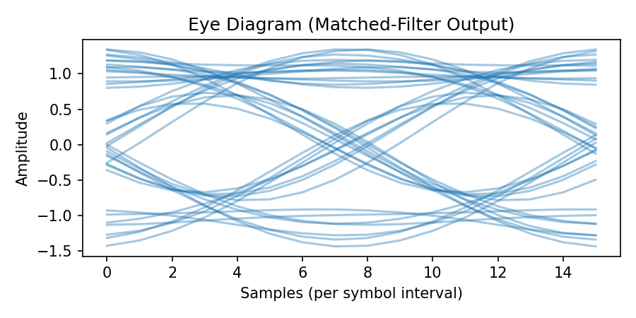

# Boring Project Series — Episode 10: Matched Filter & Timing Recovery

This repository contains a compact set of educational simulations illustrating
matched filtering, root-raised-cosine (RRC) pulse shaping, AWGN scaling for
Eb/N0, and the Gardner Timing Error Detector (TED) for blind timing recovery.

This is part of the "Boring Project Series" (Ep10).

Contents

- `src/` — simulation modules and utilities:
  - `rrc_utils.py` — RRC tap generator (unity-sum normalization)
  - `bpsk_sim.py` — end-to-end BPSK simulation (module)
  - `ted_sim.py` — Gardner TED simulation (module)
  - `plots.py` — plotting helpers
  - `test_rrc.py` — tests for the RRC generator
- Top-level shims: `bpsk_sim.py`, `ted_sim.py` — convenience scripts so you
  can run `python bpsk_sim.py` or `python ted_sim.py` from the repo root.
- `run-all.sh` — small runner that executes the demonstrations and writes
  timestamped logs in `logs/` (it no longer installs packages by default).
- `theory.md` — expanded notes and derivations (RRC, AWGN scaling, Gardner TED).
- `.gitignore` — ignores logs, plots, virtualenvs and other artifacts.

Quick start

1. Make the runner executable (already done in this repo):

```bash
chmod +x run-all.sh
```

2. Run the full demo (writes logs to `logs/` and plots to `plots/`):

```bash
./run-all.sh
```

Note: `run-all.sh` intentionally does not call `pip` (it assumes you
already have required packages installed). If you prefer to manage
dependencies in a venv, create/activate one before running.

Quick smoke tests

Run the BPSK sim for a smaller number of bits (fast):

```bash
python bpsk_sim.py --n_bits 1000 --snr_min 5 --snr_max 15 --snr_step 5
```

Run the TED sim (default quick settings):

```bash
python ted_sim.py --n_bits 3000 --ebn0_db 15 --mu_initial 2.0 --k_p 0.005
```

What this demonstrates (summary of observed behavior)

- With correct matched filtering and sampling at the eye center, BPSK
  achieves very low BER at moderate Eb/N0.
- Sampling at the symbol boundary (bad timing) produces ISI and a BER
  floor even at high SNR.
- The Gardner TED recovers timing for moderate initial offsets (converges
  to the correct sampling instant when properly implemented and tuned).
  Very large offsets or incorrectly sampled midpoints may prevent
  convergence without gain tuning.

Paper trail and resources

- See `theory.md` for derivations, practical tips, and recommended
  parameter ranges.
- Standard references: Proakis & Salehi (Digital Communications), and
  classical Gardner timing recovery papers.

Next steps and suggestions

- Convert `theory.md` into a Jupyter notebook with interactive eye plots
  and step-through numeric checks of the AWGN formula.
- Add CI that runs the RRC unit tests and a short smoke run for the
  simulations to prevent regressions.
- Add optional flags to `run-all.sh` for `--quick` runs and to toggle
  whether plots are saved.

License and attribution

This project is educational. Use and adapt the code for learning and
experimentation. No license file is included; add one if you intend to
publish or redistribute this repository.

Enjoy the snapshots

